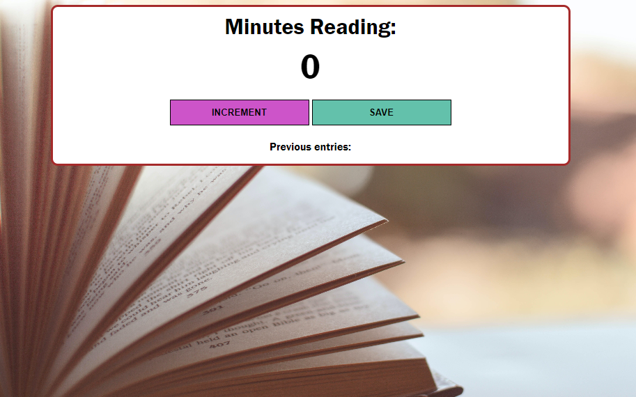

# javaPrac
Great small project using HTML, CSS and Javascript. 
The point of the project is to save each minute that has been used to read. This is in order to put in practice the getElementById and also use incrementing numbers and reseting them all by applying functions.

